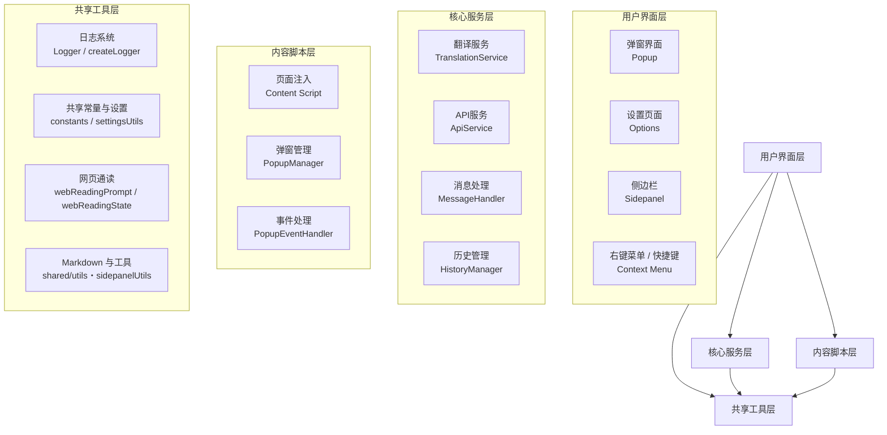

# 人话翻译器项目 (Human Text Translator)

## 项目概述

**人话翻译器**是一个基于 React + WXT 框架开发的 Chrome 扩展程序，旨在借助 AI 的力量将专业术语翻译成通俗易懂的"人话"。该扩展支持多种使用方式，包括右键菜单翻译、快捷键操作、弹窗界面翻译与侧边栏对话，并具备流式响应、思维链模式、历史管理、网页正文附加与长文通读等功能。

**基本信息**：
- **技术栈**: React 19 + TypeScript + WXT 0.20.6 + Vite
- **包管理器**: Bun（项目级默认，见 AGENTS.md，勿引入 npm / pnpm / yarn）
- **扩展类型**: Chrome Extension MV3（`minimum_chrome_version: "141"`）
- **版本**: 1.5.3（`wxt.config.ts` 与 `package.json` 各有一处，含义不同：前者决定生成的 manifest 版本号，后者决定 zip 包名）
- **开发时间**: 2025年8月至今（首个提交为 2025-08-25）

## 系统架构



> 说明：设置管理**没有** `SettingsManager` 类，`entrypoints/background/index.ts:15` 明确记录它已被
> `SettingsUtils`（`entrypoints/shared/settingsUtils.ts`）取代；日志系统也**没有** `UniversalLogger`。

## 模块结构

### 核心模块 (Core Module)
- **路径**: `entrypoints/background/`
- **职责**: 翻译核心逻辑、API 请求、消息路由
- **入口**: `index.ts`

### UI 模块 (UI Module)
- **路径**: `entrypoints/popup/`
- **职责**: 用户界面组件、交互逻辑
- **入口**: `App.tsx`

### 内容脚本模块 (Content Module)
- **路径**: `entrypoints/content/`
- **职责**: 页面注入、弹窗管理、事件处理
- **入口**: `index.ts`

### 设置模块 (Settings Module)
- **路径**: `entrypoints/options/`
- **职责**: 配置管理、用户设置
- **入口**: `Options.tsx`

### 侧边栏模块 (Sidepanel Module)
- **路径**: `entrypoints/sidepanel/`
- **职责**: 多轮对话、网页正文附加与网页通读进度管理
- **入口**: `App.tsx`（另有 `webReadingProgressStorage.ts` 负责进度落盘）

### 共享模块 (Shared Module)
- **路径**: `entrypoints/shared/`, `shared/`
- **职责**: 共享工具、日志系统、常量定义、聊天协议与网页通读状态机

## 技术栈详情

### 前端技术
- **React 19** - 用户界面框架
- **TypeScript** - 类型安全
- **Less** - CSS 预处理器
- **Vite** - 构建工具

### 扩展开发
- **WXT 0.20.6** - 浏览器扩展开发框架
- **Chrome Extension MV3** - 扩展标准
- **WebExtensions API** - 跨浏览器 API

### 核心依赖
- **Fuse.js** - 历史记录模糊搜索
- **dayjs** - 日期处理
- **lodash-es** - 工具函数
- **ahooks** - React Hooks 工具集
- **classnames** - 类名拼接
- **@icon-park/react** - 图标库

日志与调试使用项目自研的 `entrypoints/shared/logger`（见「调试技巧」），**不依赖 `debug` 包**。

## 核心功能

### 1. AI 翻译能力
- ✅ baseUrl / model 可配置（默认 DeepSeek，OpenAI 风格 `chat/completions` 接口）
- ✅ 流式响应显示
- ✅ 思维链推理模式（`thinkingEnabled`）
- ✅ 自定义提示词模板（**原样**作为 system message 发送，无占位符替换，见 `constants/index.ts:73`）
- ✅ 图片上传翻译（多模态 `image_url` 内容块）

### 2. 用户交互方式
- ✅ 右键菜单翻译
- ✅ 快捷键：`Alt+D`（翻译选中文本）、`Alt+S`（显示/隐藏侧边栏）；macOS 对应 `Option+D` / `Option+S`（`wxt.config.ts` 的 `commands`）
- ✅ 弹窗界面翻译
- ✅ 文本选择翻译

### 3. 网页通读与对话
- ✅ 侧边栏多轮对话
- ✅ 「通读当前网页」：把网页正文附加为当前会话的上下文卡片（`contextOnly`），不新建会话、不自动发起模型请求
- ✅ 长文分段续读与进度落盘（`webReadingState` / `webReadingProgressStorage`）
- ✅ 「30 分钟问题诊断」日志会话

### 4. 数据管理
- ✅ 历史记录管理（最多 `MAX_HISTORY_COUNT = 142` 条，仅 `storage.local`）
- ✅ 智能搜索功能（Fuse.js）
- ✅ 数据导入/导出
- ✅ 设置项经 `storage.sync` 跨设备同步（`apiKey` 显式剔除，仅存 `storage.local`）

## 项目规范

### 代码风格
- **TypeScript 严格模式**：启用所有严格检查
- **React Hooks 规范**：遵循官方最佳实践
- **函数式组件**：优先使用函数式组件和 Hooks
- **类型安全**：所有 API 和状态都有完整类型定义

### 架构原则
- **单一职责**：入口按 WXT 约定拆分（background / content / popup / options / sidepanel），共享逻辑沉到 `entrypoints/shared/`
- **消息驱动**：模块间通过 `MESSAGE_TYPES` 常量化的 runtime 消息通信，请求身份由 `requestProtocol.ts` 的 `createRequestId` / `TranslationTarget` 统一管理
- **错误码化**：错误经 `shared/errors.ts` 的 `CodedError` 携带 `ErrorCode`，取代字符串 `includes` 反查来源
- **类型优先**：请求/设置/聊天消息均有显式接口（`TranslationRequest`、`UserSettings`、`ChatMessage`）

### 开发流程
- **模块化开发**：按功能模块独立开发
- **类型优先**：先定义类型，再实现功能
- **测试**：`bun test` 当前 **396 个用例 / 33 个文件全绿**（本次核对时运行结果），质量闸门为 `tsc --noEmit` + `bun test`
- **文档先行**：重要功能需要文档说明

## 关键配置

### WXT 配置
```typescript
export default defineConfig({
  modules: ["@wxt-dev/module-react"],
  manifest: {
    name: "人话翻译器",
    version: "1.5.3",              // 决定生成 manifest 的版本号
    minimum_chrome_version: "141",
    permissions: ["contextMenus", "storage", "activeTab", "tabs", "sidePanel"],
    commands: {                     // Alt+D 翻译选中文本；Alt+S 显示/隐藏侧边栏
      "translate-selection": { suggested_key: { default: "Alt+D", mac: "Option+D" } },
      "open-sidepanel": { suggested_key: { default: "Alt+S", mac: "Option+S" } },
    },
    options_page: "options.html",    // 构建钩子会删掉 options_ui，强制全屏标签页打开
    side_panel: { default_path: "entrypoints/sidepanel/index.html" },
  },
});
```
（上面只保留关键字段并做了排版压缩，完整内容以 `wxt.config.ts` 为准。）

### 项目依赖
```json
{
  "dependencies": {
    "@icon-park/react": "^1.4.2",
    "ahooks": "^3.9.6",
    "classnames": "^2.5.1",
    "dayjs": "^1.11.13",
    "fuse.js": "^7.1.0",
    "less": "^4.4.1",
    "lodash-es": "^4.17.21",
    "react": "^19.1.0",
    "react-dom": "^19.1.0"
  },
  "devDependencies": {
    "@playwright/test": "^1.63.0",
    "@testing-library/react": "^16.3.3",
    "@types/bun": "1.4.1",
    "typescript": "^5.8.3",
    "vite": "^7.1.5",
    "wxt": "^0.20.6"
  }
}
```
（上表为节选；`package.json` 另有 `@happy-dom/global-registrator`、`@wxt-dev/module-react`、
`vite-tsconfig-paths`、`@types/*` 等开发依赖。`@types/bun: 1.4.1` 为精确版本，其余为 `^` 范围。）

## 开发指南

### 环境搭建
1. 安装依赖：`bun install`
2. 开发模式：`bun run dev`
3. 类型检查：`bun run compile`（等价别名 `bun run typecheck`，二者都是 `tsc --noEmit`）
4. 跑测试：`bun run test`
5. 构建扩展：`bun run build`
6. 打包发布：`bun run zip`

> 项目**没有**配置 ESLint 或 Prettier（仓库内无 eslint / prettier / biome 配置文件）；当前唯一的自动化质量闸门是 `tsc --noEmit` 与 `bun test`。

### 目录结构
```
humanTextReact/
├── entrypoints/           # 扩展各入口（WXT 约定目录）
│   ├── background/       # Service Worker：翻译核心、API 调用、消息路由
│   ├── content/          # 内容脚本：划词、浮窗、浮动操作栏
│   ├── popup/            # 工具栏弹窗界面
│   ├── options/          # 设置页（全屏标签页模式）
│   ├── sidepanel/        # 侧边栏对话与网页通读
│   └── shared/           # 跨入口共享：设置、日志、常量、业务状态机
├── shared/               # 项目根级共享：markdown 解析（utils/）与样式（styles/）
├── tests/                # unit / integration / contracts / components / helpers / e2e
├── docs/                 # 设计与排查文档
└── public/               # 静态资源
```

### 调试技巧
- 用 `createLogger(namespace, emoji, prefix?)` 打日志（`entrypoints/shared/logger`，自研实现，非 `debug` 包）
- 设置页可开启「30 分钟问题诊断」（`DIAGNOSTIC_DURATION_MS = 30 * 60 * 1000`）。
  `LoggerContext` 类型含 background / content / popup / options / **sidepanel** 五个值，
  但 `logger/diagnostics.ts` 的 `LOGGER_CONTEXTS` 允许列表只有前四个，**sidepanel 上下文的诊断记录会被丢弃**
- 日志会自动脱敏：`apiKey` / `authorization` / `token` / `cookie` / `password` / `secret` / `selectionContext`
  字段整体替换为 `[REDACTED]`；`selectionText` / `paragraph` / `textPreview` / `promptTemplate` /
  `reasoningContent` / `imageData` / `base64` 等私密文本只保留长度摘要；`url` 字段降级为 `协议//主机`；
  字符串中的 `Bearer xxx` 与 `api_key: xxx` 也会被替换
- 诊断记录写入 `storage.session`，上限 500 条 / 512 KB
- 其余用 Chrome DevTools 的 Console / Network / Service Worker 面板

## 维护信息

- **最后更新**: 2026年9月11日（对齐网页正文附加、默认模型与错误码等变更）
- **文档状态**: 结构与文件清单可靠；**不代表测试覆盖率的承诺**
- **已知缺口**: 无 ESLint / Prettier；组件级测试只覆盖 options 与 sidepanel
  （`tests/components/Options.component.tsx`、`SidepanelApp.component.tsx`、`PromptQueue.component.tsx`），
  popup 与 content 无组件测试

## 模块索引

- [**核心服务模块**](./entrypoints/background/CLAUDE.md) - 翻译服务和后台逻辑
- [**UI 模块**](./entrypoints/popup/CLAUDE.md) - 用户界面组件
- [**内容脚本模块**](./entrypoints/content/CLAUDE.md) - 页面注入和交互
- [**设置模块**](./entrypoints/options/CLAUDE.md) - 配置管理
- [**侧边栏模块**](./entrypoints/sidepanel/) - 对话与网页通读
- [**共享模块**](./entrypoints/shared/CLAUDE.md) - 共享工具和常量

---

*本文档由 AI 生成，描述的是文档编写时的代码。**以源码为准**；发现不符请直接修正本文档。*

## 变更记录 (Changelog)

### 2026-09-11 · v1.5.0 按提供商适配请求参数
- ➕ 新增 `entrypoints/shared/modelCatalog.ts`：按 `baseUrl` 的 host 识别提供商并产出请求参数，
  `translationService` 与 `apiService` **共用同一套参数生成逻辑**
- 🔧 修复智谱 GLM 快速模式的硬故障：其 `thinking.type` 只接受 `enabled`（官方文档），
  改为恒开思考 + 用 `reasoning_effort` 降强度（快速 `medium` / 深度 `high`）
- 🔧 Kimi 省略 `temperature`（其参数表未列出该字段）；OpenRouter 改用 `reasoning:{effort}`；
  通义千问改用顶层 `enable_thinking`；火山引擎沿用 `thinking:{type}` 并标注「待联调」
- 🔧 连接测试去掉硬编码的 `temperature: 0.1` / `max_tokens: 5`，改为按提供商生成，
  `max_tokens` 提到 512；新增三态判定（正文 / 仅有思考 / 无法判定），
  修掉「报连接成功但模型实际没输出」的假阳性
- 📌 两条不变量已由测试钉死：① DeepSeek 与任何未识别端点的请求体与改造前逐字节相同；
  ② 连接测试与正式翻译对同一模型的参数不存在矛盾
- 📌 版本升至 **1.5.0**（`wxt.config.ts` 与 `package.json` 两处）

### 2026-09-11 - 对齐「网页正文附加为上下文」等近期变更
- 🔧 架构图去除源码中**不存在**的类名：`SettingsManager`（`entrypoints/background/index.ts:15`
  注明已被 `SettingsUtils` 取代）、`UniversalLogger`（日志实现为 `Logger` / `createLogger`）；
  `EventHandler` 更正为 `PopupEventHandler`；新增侧边栏（sidepanel）节点
- 🔧 快捷键声明更正：原文写 `Alt+H`，实际为 `Alt+D`（翻译选中文本）/ `Alt+S`（显示或隐藏侧边栏），
  macOS 对应 `Option+D` / `Option+S`（`wxt.config.ts` 的 `commands`）
- ➕ 核心功能补入侧边栏对话、「通读当前网页」把正文附加为当前会话上下文（`contextOnly`）、
  长文分段续读与进度落盘；「支持多种 AI 模型」改为可验证的「baseUrl / model 可配置」
- 🔧 调试章节：脱敏字段改写为源码中真实存在的模式（`apiKey`/`authorization`/… 与
  `selectionText`/`paragraph`/`promptTemplate`/`imageData` 类私密文本、`url` 降级）；
  诊断上下文澄清为「`LoggerContext` 含 sidepanel，但 `LOGGER_CONTEXTS` 允许列表只有四个」
- 🔧 「已知缺口」由「UI 层无单元测试覆盖」更正为「popup / content 无组件测试」，
  并列出真实存在的组件测试文件
- 🔧 模块结构的共享模块路径移除残留的 `common/`；目录树 `tests/` 补上 `helpers/`
- 🔧 依赖清单补全为 `package.json` 中的真实条目与版本；WXT 配置示例改为真实字段
- 📌 本次核对：`bun test` **396 用例 / 33 文件全绿**；仓库内无 ESLint / Prettier / Biome 配置文件

### 2026-09-10 - 文档纠错
- 🔧 修正包管理器：`npm` → **Bun**（与 AGENTS.md 的包管理器策略对齐）
- 🔧 移除不存在的依赖 `debug`；修正 React / TypeScript 版本号
- 🔧 移除不存在的 `common/` 目录及其死链，补齐真实目录树
- 🔧 删除「覆盖率 100% / 缺口：无」等无依据的结论
- 📌 记录真实约束：**无 ESLint / Prettier**，质量闸门只有 `tsc --noEmit` 与 `bun test`

### 2025-09-24 05:32 - 架构初始化
- 建立模块级文档索引与 Mermaid 架构图
- ⚠️ 初版声称的「模块覆盖率 100%」「缺口：无」与实际不符，已于 2026-09-10 移除