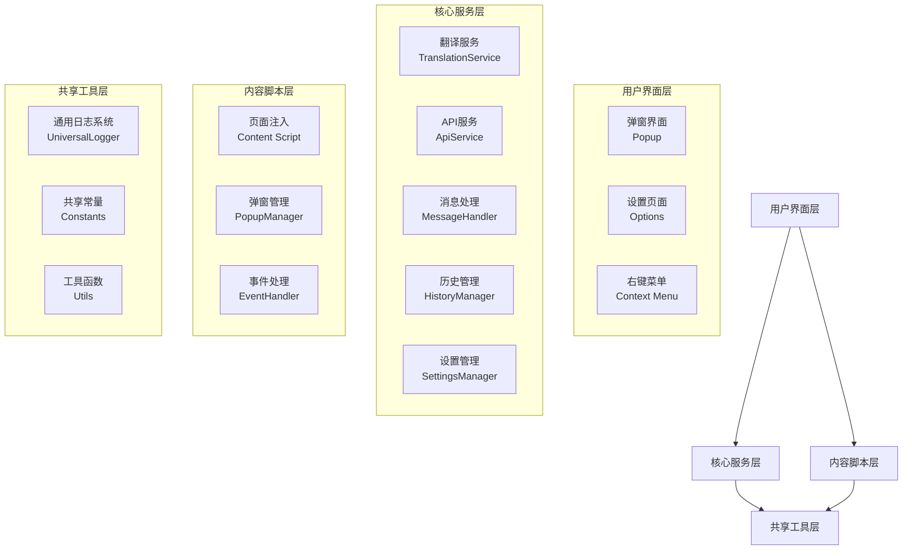

# 人话翻译器项目 (Human Text Translator)

## 项目概述

**人话翻译器**是一个基于 React + WXT 框架开发的 Chrome 扩展程序，旨在借助 AI 的力量将专业术语翻译成通俗易懂的"人话"。该扩展支持多种使用方式，包括右键菜单翻译、快捷键操作、弹窗界面翻译，并具备流式响应、思维链模式、历史管理等先进功能。

**基本信息**：
- **技术栈**: React 19 + TypeScript + WXT 0.20.6 + Vite
- **包管理器**: Bun（项目级默认，见 AGENTS.md，勿引入 npm / pnpm / yarn）
- **扩展类型**: Chrome Extension MV3
- **版本**: 1.4.0
- **开发时间**: 2025年8月至今

## 系统架构



## 模块结构

### 核心模块 (Core Module)
- **路径**: `entrypoints/background/`
- **职责**: 翻译核心逻辑、API 请求、消息路由
- **入口**: `index.ts`

### UI 模块 (UI Module)
- **路径**: `entrypoints/popup/`
- **职责**: 用户界面组件、交互逻辑
- **入口**: `App.tsx`

### 内容脚本模块 (Content Module)
- **路径**: `entrypoints/content/`
- **职责**: 页面注入、弹窗管理、事件处理
- **入口**: `index.ts`

### 设置模块 (Settings Module)
- **路径**: `entrypoints/options/`
- **职责**: 配置管理、用户设置
- **入口**: `Options.tsx`

### 共享模块 (Shared Module)
- **路径**: `entrypoints/shared/`, `shared/`, `common/`
- **职责**: 共享工具、日志系统、常量定义

## 技术栈详情

### 前端技术
- **React 19** - 用户界面框架
- **TypeScript** - 类型安全
- **Less** - CSS 预处理器
- **Vite** - 构建工具

### 扩展开发
- **WXT 0.20.6** - 浏览器扩展开发框架
- **Chrome Extension MV3** - 扩展标准
- **WebExtensions API** - 跨浏览器 API

### 核心依赖
- **Fuse.js** - 历史记录模糊搜索
- **dayjs** - 日期处理
- **lodash-es** - 工具函数
- **ahooks** - React Hooks 工具集
- **classnames** - 类名拼接
- **@icon-park/react** - 图标库

日志与调试使用项目自研的 `entrypoints/shared/logger`（见「调试技巧」），**不依赖 `debug` 包**。

## 核心功能

### 1. AI 翻译能力
- ✅ 支持多种 AI 模型
- ✅ 流式响应显示
- ✅ 思维链推理模式
- ✅ 自定义提示词模板
- ✅ 图片上传翻译

### 2. 用户交互方式
- ✅ 右键菜单翻译
- ✅ 快捷键操作 (Alt+H)
- ✅ 弹窗界面翻译
- ✅ 文本选择翻译

### 3. 数据管理
- ✅ 历史记录管理
- ✅ 智能搜索功能
- ✅ 数据导入/导出
- ✅ 本地存储同步

## 项目规范

### 代码风格
- **TypeScript 严格模式**：启用所有严格检查
- **React Hooks 规范**：遵循官方最佳实践
- **函数式组件**：优先使用函数式组件和 Hooks
- **类型安全**：所有 API 和状态都有完整类型定义

### 架构原则
- **单一职责**：每个模块职责单一，相互独立
- **依赖注入**：使用工厂模式和依赖注入
- **消息驱动**：模块间通过消息通信
- **错误隔离**：完善的错误处理和恢复机制

### 开发流程
- **模块化开发**：按功能模块独立开发
- **类型优先**：先定义类型，再实现功能
- **测试驱动**：关键功能需要有测试覆盖
- **文档先行**：重要功能需要文档说明

## 关键配置

### WXT 配置
```typescript
// wxt.config.ts
- Chrome Extension MV3
- React 19 支持
- Less 预处理器
- TypeScript 严格模式
```

### 项目依赖
```json
{
  "dependencies": {
    "react": "^19.1.0",
    "react-dom": "^19.1.0"
  },
  "devDependencies": {
    "typescript": "^5.8.3",
    "wxt": "^0.20.6",
    "vite": "^7.1.5"
  }
}
```

## 开发指南

### 环境搭建
1. 安装依赖：`bun install`
2. 开发模式：`bun run dev`
3. 类型检查：`bun run compile`
4. 跑测试：`bun run test`
5. 构建扩展：`bun run build`
6. 打包发布：`bun run zip`

> 项目**没有**配置 ESLint 或 Prettier；当前唯一的自动化质量闸门是 `tsc --noEmit` 与 `bun test`。

### 目录结构
```
humanTextReact/
├── entrypoints/           # 扩展各入口（WXT 约定目录）
│   ├── background/       # Service Worker：翻译核心、API 调用、消息路由
│   ├── content/          # 内容脚本：划词、浮窗、浮动操作栏
│   ├── popup/            # 工具栏弹窗界面
│   ├── options/          # 设置页（全屏标签页模式）
│   ├── sidepanel/        # 侧边栏对话与网页通读
│   └── shared/           # 跨入口共享：设置、日志、常量、业务状态机
├── shared/               # 项目根级共享：markdown 解析与样式
├── tests/                # unit / integration / contracts / components / e2e
├── docs/                 # 设计与排查文档
└── public/               # 静态资源
```

### 调试技巧
- 用 `createLogger(namespace, emoji)` 打日志（`entrypoints/shared/logger`，自研实现，非 `debug` 包）
- 设置页可开启「30 分钟问题诊断」，诊断日志覆盖 Background / Content / Popup / Options 四个上下文
- 日志会自动脱敏 API Key、Authorization、原文、译文与图片内容
- 其余用 Chrome DevTools 的 Console / Network / Service Worker 面板

## 维护信息

- **最后更新**: 2026年9月10日（修正文档中与实际代码不符的陈述）
- **文档状态**: 结构与文件清单可靠；**不代表测试覆盖率的承诺**
- **已知缺口**: 无 ESLint / Prettier；UI 层（popup / options / sidepanel / content）无单元测试覆盖，仅共享逻辑有较高覆盖

## 模块索引

- [**核心服务模块**](./entrypoints/background/CLAUDE.md) - 翻译服务和后台逻辑
- [**UI 模块**](./entrypoints/popup/CLAUDE.md) - 用户界面组件
- [**内容脚本模块**](./entrypoints/content/CLAUDE.md) - 页面注入和交互
- [**设置模块**](./entrypoints/options/CLAUDE.md) - 配置管理
- [**侧边栏模块**](./entrypoints/sidepanel/) - 对话与网页通读
- [**共享模块**](./entrypoints/shared/CLAUDE.md) - 共享工具和常量

---

*本文档由 AI 生成，描述的是文档编写时的代码。**以源码为准**；发现不符请直接修正本文档。*

## 变更记录 (Changelog)

### 2026-09-10 - 文档纠错
- 🔧 修正包管理器：`npm` → **Bun**（与 AGENTS.md 的包管理器策略对齐）
- 🔧 移除不存在的依赖 `debug`；修正 React / TypeScript 版本号
- 🔧 移除不存在的 `common/` 目录及其死链，补齐真实目录树
- 🔧 删除「覆盖率 100% / 缺口：无」等无依据的结论
- 📌 记录真实约束：**无 ESLint / Prettier**，质量闸门只有 `tsc --noEmit` 与 `bun test`

### 2025-09-24 05:32 - 架构初始化
- 建立模块级文档索引与 Mermaid 架构图
- ⚠️ 初版声称的「模块覆盖率 100%」「缺口：无」与实际不符，已于 2026-09-10 移除