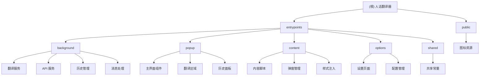

# 人话翻译器 - Chrome 扩展项目

## 项目愿景

人话翻译器是一个基于 AI 的 Chrome 扩展，致力于将专业术语和复杂内容翻译成通俗易懂的"人话"。通过集成先进的 AI 模型，为用户提供实时、准确的文本翻译服务，特别适合处理技术文档、学术内容和专业术语。

## 架构总览

### 技术栈
- **前端框架**: React 19 + TypeScript
- **构建工具**: WXT 0.20.6 + Vite
- **样式处理**: Less 预处理器
- **浏览器标准**: Chrome Extension MV3
- **AI 集成**: DeepSeek API / 支持流式响应

### 核心特性
- 🎯 智能翻译能力（支持流式响应和思维链模式）
- 🖱️ 多样化使用方式（右键菜单、快捷键、弹窗界面）
- 📚 历史记录管理（本地存储 + 云端同步）
- ⚙️ 灵活配置选项（自定义 API、模型选择、提示词模板）

## 模块结构图



## 模块索引

| 模块路径 | 职责描述 | 技术栈 | 状态 |
|---------|---------|--------|------|
| `entrypoints/background` | 后台服务，处理翻译逻辑、API 调用、消息路由 | TypeScript | ✅ 已识别 |
| `entrypoints/popup` | 用户界面，提供翻译输入、结果显示、历史管理 | React + TypeScript + Less | ✅ 已识别 |
| `entrypoints/content` | 内容脚本，处理页面交互、弹窗显示、样式注入 | TypeScript | ✅ 已识别 |
| `entrypoints/options` | 设置页面，提供 API 配置、参数调优、快捷键管理 | React + TypeScript + Less | ✅ 已识别 |
| `entrypoints/shared` | 共享资源，包含常量定义、类型声明 | TypeScript | ✅ 已识别 |
| `public` | 静态资源，包含扩展图标、UI 资源 | 图标文件 | ✅ 已识别 |

## 运行与开发

### 开发环境
- Node.js 16+
- npm 或 yarn 包管理器

### 开发命令
```bash
# 安装依赖
npm install

# Chrome 开发模式（支持热重载）
npm run dev

# Firefox 开发模式
npm run dev:firefox

# 生产构建
npm run build

# 生成扩展包
npm run zip

# 类型检查
npm run compile
```

### 扩展安装
1. 运行 `npm run build` 构建扩展
2. 打开 Chrome 浏览器，访问 `chrome://extensions/`
3. 开启"开发者模式"
4. 点击"加载已解压的扩展程序"
5. 选择 `.output/chrome-mv3/` 目录

## 测试策略

### 测试覆盖范围
- **单元测试**: 各模块的核心功能和服务类
- **集成测试**: 模块间消息传递和数据流
- **端到端测试**: 完整的翻译流程和用户交互
- **扩展兼容性**: Chrome 和 Firefox 平台兼容性

### 测试工具推荐
- **框架**: Jest + React Testing Library
- **扩展测试**: Selenium / Puppeteer
- **API 模拟**: MSW (Mock Service Worker)

## 编码规范

### 代码风格
- **TypeScript**: 严格类型检查，完善类型定义
- **React**: 函数组件 + Hooks 模式
- **CSS/Less**: BEM 命名规范，模块化样式
- **命名**: 使用语义化的变量和函数命名

### 项目结构约定
- 每个模块职责单一，依赖关系清晰
- 共享常量统一在 `shared` 模块管理
- 错误处理完善，用户友好的错误提示
- 支持 Chrome Extension MV3 规范

## AI 使用指引

### 项目特点
- **模块化架构**: 清晰的模块划分，便于理解和修改
- **现代化技术栈**: React 19 + TypeScript + WXT 框架
- **完善的错误处理**: 多层次的错误捕获和用户反馈
- **流式响应支持**: 实时显示翻译过程，提升用户体验

### 开发建议
- 新增功能时优先考虑模块复用和扩展性
- 修改核心翻译服务时注意兼容性测试
- UI 修改时保持设计一致性和用户体验
- 添加新的 AI 模型支持时遵循现有接口规范

## 变更记录 (Changelog)

### 2025-11-26 23:32:46
- 初始化项目 AI 上下文
- 完成项目架构分析和模块识别
- 生成根级 CLAUDE.md 文档
- 创建模块结构图和索引
- 建立开发规范和使用指引