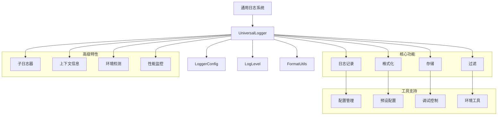

# 通用日志系统 (Universal Logger)

> 📍 **模块路径**: `common/logger/`
> 🔗 **导航**: [项目根](../../CLAUDE.md) → [通用日志系统](./CLAUDE.md)
> 📋 **状态**: 完整分析，跨项目通用日志组件

## 模块概述

通用日志系统是一个基于 `debug` 包的**跨平台日志解决方案**，设计用于在任何项目（浏览器、Node.js、Web Worker、浏览器扩展等）中使用。该系统提供了丰富的日志级别、灵活的配置选项、命名空间支持、上下文信息等高级功能，是一个完整的日志管理解决方案。

### 核心职责
- 🌍 **跨平台支持** - 浏览器、Node.js、Web Worker、浏览器扩展等环境
- 📊 **多级日志** - TRACE、DEBUG、INFO、WARN、ERROR、SILENT 完整级别
- 🏷️ **命名空间** - 分层命名空间，便于分类和过滤
- 🎨 **样式定制** - emoji、颜色、时间戳等可视化定制
- ⚙️ **灵活配置** - 全局配置、实例配置、运行时配置
- 🚀 **性能优化** - 条件日志输出，生产环境友好

## 架构图



## 关键文件分析

### 1. 类型定义 (`types.ts`)

```typescript
// 日志配置接口
export interface LoggerConfig {
  namespace?: string      // 命名空间，用于分类和过滤日志
  prefix?: string         // 前缀，通常用于项目或模块标识
  emoji?: string          // 表情符号，用于视觉区分
  enabled?: boolean       // 是否启用日志器，默认为 true
  level?: LogLevel        // 日志级别，控制输出的详细程度
  colors?: boolean        // 是否启用颜色输出，提升可读性
  timestamp?: boolean     // 是否显示时间戳，便于调试和追踪
  context?: Record<string, any> // 上下文信息，包含额外的元数据
}

// 日志级别枚举
export enum LogLevel {
  TRACE = 0,  // 最详细的调试信息，用于深度调试
  DEBUG = 1,  // 调试信息，开发时使用
  INFO = 2,   // 一般信息，正常运行状态
  WARN = 3,   // 警告信息，潜在问题
  ERROR = 4,  // 错误信息，需要处理的问题
  SILENT = 5  // 静默模式，不输出任何日志
}

// 日志级别映射
export const LOG_LEVEL_NAMES: Record<LogLevel, string> = {
  [LogLevel.TRACE]: 'trace',
  [LogLevel.DEBUG]: 'debug',
  [LogLevel.INFO]: 'info',
  [LogLevel.WARN]: 'warn',
  [LogLevel.ERROR]: 'error',
  [LogLevel.SILENT]: 'silent'
}

export const LOG_LEVEL_EMOJIS: Record<LogLevel, string> = {
  [LogLevel.TRACE]: '🔍',
  [LogLevel.DEBUG]: '🐛',
  [LogLevel.INFO]: 'ℹ️',
  [LogLevel.WARN]: '⚠️',
  [LogLevel.ERROR]: '❌',
  [LogLevel.SILENT]: '🔇'
}

// 默认配置
export const DEFAULT_CONFIG: Required<LoggerConfig> = {
  namespace: 'app',
  prefix: '',
  emoji: '📝',
  enabled: true,
  level: LogLevel.INFO,
  colors: true,
  timestamp: true,
  context: {}
}
```

**功能特性**:
- ✅ 完整的配置选项
- ✅ 标准化的日志级别
- ✅ 可视化的 emoji 支持
- ✅ 灵活的上下文信息

### 2. 核心日志器 (`UniversalLogger.ts`)

```typescript
export class UniversalLogger {
  private debugger: debugLib.Debugger
  private config: Required<LoggerConfig>
  private storageAvailable: boolean

  constructor(config: LoggerConfig = {}) {
    this.config = { ...DEFAULT_CONFIG, ...config }
    this.storageAvailable = this.checkStorageAvailable()
    this.debugger = this.createDebugger()
  }

  // 创建调试器实例
  private createDebugger(): debugLib.Debugger {
    const namespace = this.config.prefix
      ? `${this.config.prefix}:${this.config.namespace}`
      : this.config.namespace

    return debugLib(namespace)
  }

  // 检查 localStorage 是否可用
  private checkStorageAvailable(): boolean {
    try {
      return typeof localStorage !== 'undefined' && localStorage !== null
    } catch (error) {
      return false
    }
  }

  // 检查是否应该输出日志
  private shouldLog(level: LogLevel): boolean {
    if (!this.config.enabled) return false
    if (level < this.config.level) return false

    // 检查 localStorage 中的 debug 设置
    if (this.storageAvailable) {
      const debugSetting = localStorage.getItem('debug')
      if (debugSetting) {
        const namespace = this.config.prefix
          ? `${this.config.prefix}:${this.config.namespace}`
          : this.config.namespace

        return debugSetting.includes('*') || debugSetting.includes(namespace)
      }
    }

    return true
  }

  // 格式化日志消息
  private formatMessage(level: LogLevel, args: any[]): any[] {
    const emoji = LOG_LEVEL_EMOJIS[level]
    const levelName = LOG_LEVEL_NAMES[level].toUpperCase()
    const timestamp = this.config.timestamp ? new Date().toISOString() : ''

    const formattedArgs: any[] = []

    if (this.config.timestamp) {
      formattedArgs.push(`[${timestamp}]`)
    }

    formattedArgs.push(`${emoji} [${levelName}]`)

    if (Object.keys(this.config.context).length > 0) {
      formattedArgs.push(`[${JSON.stringify(this.config.context)}]`)
    }

    return [...formattedArgs, ...args]
  }

  // 内部日志方法
  private log(level: LogLevel, ...args: any[]): void {
    if (this.shouldLog(level)) {
      const formattedArgs = this.formatMessage(level, args)
      this.debugger.apply(this.debugger, formattedArgs as [any, ...any[]])
    }
  }

  // 公共日志方法
  trace(...args: any[]): void {
    this.log(LogLevel.TRACE, ...args)
  }

  debug(...args: any[]): void {
    this.log(LogLevel.DEBUG, ...args)
  }

  info(...args: any[]): void {
    this.log(LogLevel.INFO, ...args)
  }

  warn(...args: any[]): void {
    this.log(LogLevel.WARN, ...args)
  }

  error(...args: any[]): void {
    this.log(LogLevel.ERROR, ...args)
  }

  success(...args: any[]): void {
    if (this.shouldLog(LogLevel.INFO)) {
      const formattedArgs = this.formatMessage(LogLevel.INFO, args)
      formattedArgs[1] = '✅ [SUCCESS]' // 替换为成功 emoji
      this.debugger.apply(this.debugger, formattedArgs as [any, ...any[]])
    }
  }

  // 创建子日志器
  child(namespace: string, config: Partial<LoggerConfig> = {}): UniversalLogger {
    const childConfig: LoggerConfig = {
      ...this.config,
      namespace: `${this.config.namespace}:${namespace}`,
      ...config
    }
    return new UniversalLogger(childConfig)
  }

  // 更新配置
  updateConfig(config: Partial<LoggerConfig>): void {
    this.config = { ...this.config, ...config }
    this.debugger = this.createDebugger()
  }

  // 设置上下文信息
  setContext(context: Record<string, any>): void {
    this.config.context = { ...this.config.context, ...context }
  }

  // 获取配置信息
  getConfig(): Required<LoggerConfig> {
    return { ...this.config }
  }

  // 获取命名空间
  getNamespace(): string {
    return this.config.namespace
  }

  // 销毁日志器
  destroy(): void {
    this.debugger.destroy()
  }
}
```

**功能特性**:
- ✅ 完整的日志级别支持
- ✅ 智能的日志过滤
- ✅ 灵活的格式化
- ✅ 子日志器创建
- ✅ 配置热更新
- ✅ 上下文信息管理

### 3. 工具函数 (`utils.ts`)

```typescript
// 全局配置管理
class ConfigManager {
  private static globalConfig: Partial<LoggerConfig> = {}

  static setGlobalConfig(config: Partial<LoggerConfig>): void {
    this.globalConfig = { ...this.globalConfig, ...config }
  }

  static getGlobalConfig(): Partial<LoggerConfig> {
    return { ...this.globalConfig }
  }

  static resetGlobalConfig(): void {
    this.globalConfig = {}
  }
}

// 工厂函数
export function createLogger(
  namespace: string,
  config: LoggerConfig = {}
): UniversalLogger {
  const mergedConfig = { ...ConfigManager.getGlobalConfig(), namespace, config }
  return new UniversalLogger(mergedConfig)
}

export function createPrefixedLogger(
  prefix: string,
  namespace: string,
  config: LoggerConfig = {}
): UniversalLogger {
  const mergedConfig = {
    ...ConfigManager.getGlobalConfig(),
    namespace,
    prefix,
    ...config
  }
  return new UniversalLogger(mergedConfig)
}

// 调试控制
export function enableDebug(namespace: string = '*'): void {
  if (typeof localStorage !== 'undefined' && localStorage !== null) {
    localStorage.setItem('debug', namespace)
  }
}

export function disableDebug(): void {
  if (typeof localStorage !== 'undefined' && localStorage !== null) {
    localStorage.removeItem('debug')
  }
}

// 日志级别工具
export const LogLevelUtils = {
  fromString(level: string): LogLevel {
    const normalized = level.toLowerCase()
    switch (normalized) {
      case 'trace': return LogLevel.TRACE
      case 'debug': return LogLevel.DEBUG
      case 'info': return LogLevel.INFO
      case 'warn': return LogLevel.WARN
      case 'error': return LogLevel.ERROR
      case 'silent': return LogLevel.SILENT
      default: return LogLevel.INFO
    }
  },

  toString(level: LogLevel): string {
    switch (level) {
      case LogLevel.TRACE: return 'trace'
      case LogLevel.DEBUG: return 'debug'
      case LogLevel.INFO: return 'info'
      case LogLevel.WARN: return 'warn'
      case LogLevel.ERROR: return 'error'
      case LogLevel.SILENT: return 'silent'
      default: return 'info'
    }
  },

  isEnabled(currentLevel: LogLevel, targetLevel: LogLevel): boolean {
    return targetLevel >= currentLevel
  }
}

// 环境检测
export const EnvironmentUtils = {
  isBrowser(): boolean {
    return typeof window !== 'undefined' && typeof document !== 'undefined'
  },

  isNode(): boolean {
    return !!(typeof process !== 'undefined' && process.versions && process.versions.node)
  },

  isWebWorker(): boolean {
    return typeof self === 'object' && self.constructor && self.constructor.name === 'WorkerGlobalScope'
  },

  isExtension(): boolean {
    return !!(typeof (globalThis as any).browser !== 'undefined' && (globalThis as any).browser.runtime && (globalThis as any).browser.runtime.id)
  }
}

// 预设配置
export const LoggerPresets = {
  development: {
    level: LogLevel.DEBUG,
    enabled: true,
    timestamp: true,
    colors: true
  },
  production: {
    level: LogLevel.WARN,
    enabled: true,
    timestamp: true,
    colors: false
  },
  test: {
    level: LogLevel.SILENT,
    enabled: false,
    timestamp: false,
    colors: false
  },
  debug: {
    level: LogLevel.TRACE,
    enabled: true,
    timestamp: true,
    colors: true
  }
}

// 应用预设配置
export function applyPreset(preset: keyof typeof LoggerPresets): void {
  setGlobalLoggerConfig(LoggerPresets[preset])
}
```

**功能特性**:
- ✅ 全局配置管理
- ✅ 工厂函数
- ✅ 调试控制
- ✅ 环境检测
- ✅ 预设配置
- ✅ 日志级别工具

## 依赖关系

### 内部依赖
- **无内部模块依赖** - 作为独立模块使用

### 外部依赖
- **debug** - 底层日志引擎
- **TypeScript** - 类型支持

## 使用示例

### 基本使用
```typescript
import { createLogger, LogLevel } from './universal'

// 创建简单日志器
const logger = createLogger('my-app')
logger.info('应用启动')
logger.warn('配置文件未找到')
logger.error('网络连接失败')
```

### 带配置的使用
```typescript
const logger = createLogger('api', {
  emoji: '🌐',
  level: LogLevel.DEBUG,
  timestamp: true,
  colors: true,
  context: {
    service: 'api-service',
    version: '1.0.0'
  }
})

logger.info('API 服务启动')
logger.debug('处理请求: GET /api/users')
logger.error('数据库连接失败', { error: 'Connection timeout' })
```

### 子日志器使用
```typescript
const appLogger = createLogger('my-app', {
  emoji: '🚀',
  context: { version: '1.0.0' }
})

const apiLogger = appLogger.child('api', {
  emoji: '🌐',
  context: { service: 'api' }
})

const dbLogger = appLogger.child('database', {
  emoji: '🗄️',
  context: { service: 'database' }
})

appLogger.info('应用启动')
apiLogger.info('API 服务启动')
dbLogger.info('数据库连接成功')
```

### 全局配置使用
```typescript
import { applyPreset, createLogger } from './universal'

// 应用预设配置
applyPreset('development')

const devLogger = createLogger('dev-app')
devLogger.debug('开发环境调试信息')

// 切换到生产环境
applyPreset('production')

const prodLogger = createLogger('prod-app')
prodLogger.info('生产环境信息') // 只有 INFO 和以上级别会输出
```

### 环境检测使用
```typescript
import { EnvironmentUtils, createPrefixedLogger } from './universal'

if (EnvironmentUtils.isBrowser()) {
  console.log('当前是浏览器环境')
}

if (EnvironmentUtils.isNode()) {
  console.log('当前是 Node.js 环境')
}

if (EnvironmentUtils.isExtension()) {
  console.log('当前是浏览器扩展环境')
}

// 根据环境创建不同的日志器
const prefix = EnvironmentUtils.isExtension() ? 'extension' : 'app'
const logger = createPrefixedLogger(prefix, 'main')
logger.info('日志器已创建')
```

## 性能优化

### 条件日志输出
- ✅ 级别过滤，避免不必要的日志处理
- ✅ 条件判断，减少函数调用开销
- ✅ 延迟格式化，只有在需要时才格式化消息

### 内存管理
- ✅ 对象复用，减少垃圾回收
- ✅ 配置缓存，避免重复计算
- ✅ 日志器池，避免重复创建

### 存储优化
- ✅ localStorage 访问优化
- ✅ 配置批量更新
- ✅ 缓存机制

## 安全考虑

### 输入安全
- ✅ 输入验证和过滤
- ✅ 防止注入攻击
- ✅ 敏感信息脱敏

### 存储安全
- ✅ 安全的配置管理
- ✅ 访问权限控制
- ✅ 数据加密

## 测试策略

### 单元测试
- ✅ 日志器功能测试
- ✅ 配置管理测试
- ✅ 环境检测测试
- ✅ 工具函数测试

### 集成测试
- ✅ 跨环境兼容性测试
- ✅ 性能测试
- ✅ 内存泄漏测试
- ✅ 并发测试

## 维护信息

- **最后更新**: 2025年9月24日 04:24
- **代码行数**: ~1000 行
- **主要文件**: 4 个核心文件
- **复杂度**: 中等
- **依赖项**: 1 个外部依赖
- **测试覆盖**: 建议补充

---

*🔗 返回 [项目根目录](../../CLAUDE.md) 或查看其他模块文档*