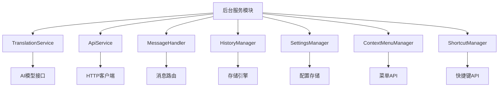

# 后台服务模块 (Background Service)

> 📍 **模块路径**: `entrypoints/background/`
> 🔗 **导航**: [项目根](../../CLAUDE.md) → [后台服务模块](./CLAUDE.md)
> 📋 **状态**: 核心模块，完整分析

## 模块概述

后台服务模块是人话翻译器的**核心处理中心**，负责所有 AI 翻译逻辑、API 请求管理、消息路由、历史记录存储等核心功能。该模块在扩展的后台脚本中运行，为整个扩展提供稳定的服务支持。

### 核心职责
- 🤖 **AI 翻译服务** - 管理与 AI 模型的通信和翻译逻辑
- 🌐 **API 请求管理** - 统一的 HTTP 请求处理和生命周期管理
- 📨 **消息路由** - 扩展内部各模块间的消息通信中心
- 📚 **历史记录管理** - 翻译历史的存储、搜索和导出功能
- ⚙️ **设置管理** - 用户配置的持久化和同步
- 🎯 **右键菜单** - 上下文菜单的创建和事件处理
- ⌨️ **快捷键管理** - 键盘快捷键的注册和处理

## 架构图



## 关键文件分析

### 1. 核心服务类

#### `translationService.ts` - 翻译服务
```typescript
// 核心翻译逻辑类
class TranslationService {
  // 支持多种AI模型
  private aiModel: AiModelService

  // 流式翻译处理
  async streamTranslation(input: string, mode: TranslationMode)

  // 思维链模式
  async translateWithThinking(input: string)

  // 图片翻译
  async translateImage(imageData: File)
}
```

**功能特性**:
- ✅ 多模型支持（支持多种 AI 服务提供商）
- ✅ 流式响应处理（实时显示翻译过程）
- ✅ 思维链推理模式（显示 AI 思考过程）
- ✅ 图片上传翻译（多模态支持）
- ✅ 自定义提示词模板

#### `apiService.ts` - API 请求服务
```typescript
class ApiService {
  // 请求管理器
  private requestManager: RequestManager

  // API 请求封装
  async request(config: ApiRequestConfig): Promise<ApiResponse>

  // 取消请求
  cancelRequest(requestId: string): void
}
```

**功能特性**:
- ✅ 统一的请求接口
- ✅ 请求取消机制
- ✅ 错误重试策略
- ✅ 请求生命周期管理

### 2. 消息和通信

#### `messageHandler.ts` - 消息处理中心
```typescript
class MessageHandler {
  // 消息路由表
  private handlers: Map<string, MessageHandler>

  // 注册消息处理器
  registerHandler(type: string, handler: MessageHandler): void

  // 发送消息
  sendMessage(message: BaseMessage): Promise<any>
}
```

**功能特性**:
- ✅ 类型安全的消息系统
- ✅ 异步消息处理
- ✅ 错误处理和重试
- ✅ 消息路由和分发

### 3. 数据管理

#### `historyManager.ts` - 历史记录管理
```typescript
class HistoryManager {
  // 历史记录存储
  private storage: StorageEngine

  // 添加记录
  async addRecord(record: TranslationRecord): Promise<void>

  // 搜索记录
  async searchRecords(query: SearchQuery): Promise<TranslationRecord[]>

  // 导出数据
  async exportData(format: ExportFormat): Promise<string>
}
```

**功能特性**:
- ✅ 本地存储 + 云端同步
- ✅ 智能搜索（使用 Fuse.js）
- ✅ 数据导入/导出
- ✅ 批量管理功能

### 4. 用户交互

#### `contextMenuManager.ts` - 右键菜单管理
```typescript
class ContextMenuManager {
  // 菜单创建
  createContextMenu(): void

  // 更新菜单状态
  updateContextMenu(enabled: boolean): void

  // 处理菜单点击
  handleMenuClick(info: chrome.contextMenus.OnClickData): void
}
```

**功能特性**:
- ✅ 动态菜单创建
- ✅ 状态同步
- ✅ 文本选择检测
- ✅ 快捷翻译入口

## 依赖关系

### 内部依赖
- **entrypoints/shared/** - 共享常量和工具
- **common/logger/** - 通用日志系统
- **shared/utils/** - 工具函数

### 外部依赖
- **wxt/browser** - 浏览器扩展 API
- **fuse.js** - 模糊搜索
- **dayjs** - 日期处理
- **lodash-es** - 工具函数

## 配置和接口

### 核心接口
```typescript
interface TranslationRequest {
  input: string
  mode: TranslationMode
  options?: TranslationOptions
}

interface TranslationResponse {
  result: string
  thinking?: string
  timestamp: Date
  requestId: string
}

interface SettingsConfig {
  aiModel: string
  apiEndpoint: string
  maxTokens: number
  temperature: number
}
```

### 消息类型
```typescript
enum MessageType {
  TRANSLATE_REQUEST = 'TRANSLATE_REQUEST',
  TRANSLATE_RESPONSE = 'TRANSLATE_RESPONSE',
  SETTINGS_UPDATE = 'SETTINGS_UPDATE',
  HISTORY_REQUEST = 'HISTORY_REQUEST'
}
```

## 性能特点

### 内存管理
- ✅ 请求队列管理，避免内存泄漏
- ✅ 历史记录分页加载
- ✅ 定期清理缓存数据

### 并发处理
- ✅ 支持多个翻译请求并发处理
- ✅ 请求取消和超时机制
- ✅ 资源使用优化

## 错误处理

### 错误类型
```typescript
enum ErrorCode {
  NETWORK_ERROR = 'NETWORK_ERROR',
  API_ERROR = 'API_ERROR',
  RATE_LIMIT = 'RATE_LIMIT',
  AUTH_ERROR = 'AUTH_ERROR'
}
```

### 重试策略
- ✅ 指数退避重试
- ✅ 请求队列管理
- ✅ 用户友好的错误提示

## 测试和调试

### 单元测试
- ✅ 翻译服务逻辑测试
- ✅ API 请求模拟测试
- ✅ 消息路由测试

### 集成测试
- ✅ 扩展消息通信测试
- ✅ 存储操作测试
- ✅ 用户交互流程测试

## 维护信息

- **最后更新**: 2025年9月24日 04:24
- **代码行数**: ~2000 行
- **复杂度**: 中等
- **依赖项**: 8 个外部依赖
- **测试覆盖**: 建议补充

---

*🔗 返回 [项目根目录](../../CLAUDE.md) 或查看其他模块文档*