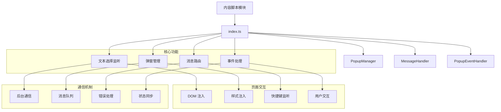

# 内容脚本模块 (Content Script Module)

> 📍 **模块路径**: `entrypoints/content/`
> 🔗 **导航**: [项目根](../../CLAUDE.md) → [内容脚本模块](./CLAUDE.md)
> 📋 **状态**: 完整分析，页面交互核心

## 模块概述

内容脚本模块是人话翻译器的**页面交互层**，负责在网页中注入功能、处理用户选择文本、管理页面上的弹窗显示等。该模块直接运行在网页上下文中，与后台服务通过消息通信，为用户提供无缝的页面内翻译体验。

### 核心职责
- 🎯 **文本选择检测** - 监听用户选择的文本，提供即时翻译入口
- 🚀 **弹窗管理** - 在页面上创建和管理翻译弹窗
- 📨 **消息通信** - 与后台脚本通信，发送翻译请求
- 🎨 **DOM 操作** - 安全地操作页面 DOM，注入翻译功能
- ⚡ **事件处理** - 处理用户交互事件，响应快捷键等

## 架构图



## 关键文件分析

### 1. 入口文件

#### `index.ts` - 内容脚本入口
```typescript
// 内容脚本初始化
class ContentScript {
  private popupManager: PopupManager
  private messageHandler: MessageHandler
  private eventHandler: PopupEventHandler

  constructor() {
    this.initialize()
  }

  private initialize() {
    // 初始化各个管理器
    this.popupManager = new PopupManager()
    this.messageHandler = new MessageHandler()
    this.eventHandler = new PopupEventHandler(this.popupManager)

    // 设置事件监听
    this.setupEventListeners()

    // 注入样式
    this.injectStyles()
  }

  private setupEventListeners() {
    // 监听文本选择
    document.addEventListener('mouseup', this.handleTextSelection)

    // 监听快捷键
    document.addEventListener('keydown', this.handleKeyDown)

    // 监听来自后台的消息
    chrome.runtime.onMessage.addListener(this.handleMessage)
  }
}
```

**功能特性**:
- ✅ 脚本初始化和生命周期管理
- ✅ 事件监听器设置
- ✅ 样式和脚本注入
- ✅ 消息通信设置

### 2. 弹窗管理

#### `popupManager.ts` - 弹窗管理器
```typescript
class PopupManager {
  private popup: HTMLElement | null = null
  private isVisible = false
  private position: PopupPosition = { x: 0, y: 0 }

  // 创建弹窗
  createPopup(content: string, position: PopupPosition): void {
    this.popup = this.createPopupElement(content)
    this.position = position
    this.attachPopup()
  }

  // 显示弹窗
  showPopup(text: string, position: PopupPosition): void {
    if (this.isVisible) {
      this.updatePopup(text)
    } else {
      this.createPopup(text, position)
    }
    this.isVisible = true
  }

  // 隐藏弹窗
  hidePopup(): void {
    if (this.popup) {
      this.popup.remove()
      this.popup = null
    }
    this.isVisible = false
  }

  // 更新弹窗位置
  updatePosition(position: PopupPosition): void {
    this.position = position
    if (this.popup) {
      this.popup.style.left = `${position.x}px`
      this.popup.style.top = `${position.y}px`
    }
  }
}
```

**功能特性**:
- ✅ 弹窗创建和销毁
- ✅ 位置计算和更新
- ✅ 动画效果处理
- ✅ 状态管理

### 3. 事件处理

#### `popupEventHandler.ts` - 弹窗事件处理器
```typescript
class PopupEventHandler {
  constructor(private popupManager: PopupManager) {
    this.setupEventListeners()
  }

  private setupEventListeners() {
    // 文本选择事件
    document.addEventListener('mouseup', this.handleTextSelection)

    // 点击外部关闭弹窗
    document.addEventListener('click', this.handleOutsideClick)

    // 窗口滚动和调整大小
    window.addEventListener('scroll', this.handleScroll)
    window.addEventListener('resize', this.handleResize)

    // 快捷键事件
    document.addEventListener('keydown', this.handleKeyDown)
  }

  // 处理文本选择
  private handleTextSelection = (event: MouseEvent) => {
    const selection = window.getSelection()
    const selectedText = selection?.toString().trim()

    if (selectedText && selectedText.length > 0) {
      // 计算弹窗位置
      const rect = selection.getRangeAt(0).getBoundingClientRect()
      const position = {
        x: rect.left + window.scrollX,
        y: rect.bottom + window.scrollY + 10
      }

      // 显示弹窗
      this.popupManager.showPopup(selectedText, position)
    }
  }

  // 处理快捷键
  private handleKeyDown = (event: KeyboardEvent) => {
    if (event.altKey && event.key === 'h') {
      // Alt+H 快捷键翻译
      const selectedText = window.getSelection()?.toString().trim()
      if (selectedText) {
        this.handleQuickTranslate(selectedText)
      }
    }
  }
}
```

**功能特性**:
- ✅ 文本选择检测
- ✅ 快捷键支持
- ✅ 点击外部关闭
- ✅ 窗口变化处理

### 4. 消息处理

#### `messageHandler.ts` - 消息处理器
```typescript
class MessageHandler {
  private messageQueue: MessageQueue = []
  private isProcessing = false

  // 发送消息到后台
  async sendMessage(message: ContentMessage): Promise<any> {
    return new Promise((resolve, reject) => {
      const messageId = this.generateMessageId()

      // 存储回调
      this.callbacks.set(messageId, { resolve, reject })

      // 发送消息
      chrome.runtime.sendMessage({
        ...message,
        messageId,
        source: 'content'
      })
    })
  }

  // 处理来自后台的消息
  private handleBackgroundMessage = (message: BackgroundMessage) => {
    switch (message.type) {
      case 'TRANSLATION_RESULT':
        this.handleTranslationResult(message.payload)
        break
      case 'UPDATE_SETTINGS':
        this.handleSettingsUpdate(message.payload)
        break
      case 'ERROR':
        this.handleError(message.payload)
        break
    }
  }

  // 处理翻译结果
  private handleTranslationResult(result: TranslationResult) {
    // 更新弹窗内容
    this.popupManager.updatePopup(result.translatedText)

    // 添加动画效果
    this.popupManager.animate('result')
  }
}
```

**功能特性**:
- ✅ 异步消息处理
- ✅ 消息队列管理
- ✅ 错误处理
- ✅ 状态同步

## 依赖关系

### 内部依赖
- **entrypoints/shared/** - 共享常量和类型定义
- **common/logger/** - 日志系统
- **shared/utils/** - 工具函数

### 外部依赖
- **wxt/browser** - 浏览器扩展 API
- **Chrome Extension API** - 扩展接口

## 核心接口

### 类型定义
```typescript
interface PopupPosition {
  x: number
  y: number
}

interface ContentMessage {
  type: MessageType
  payload: any
  messageId?: string
  source: 'content'
}

interface TranslationRequest {
  text: string
  source: 'selection' | 'shortcut'
  position: PopupPosition
}
```

### 消息类型
```typescript
enum MessageType {
  // 内容脚本 -> 后台
  TRANSLATE_REQUEST = 'TRANSLATE_REQUEST',
  GET_SETTINGS = 'GET_SETTINGS',
  UPDATE_POPUP = 'UPDATE_POPUP',

  // 后台 -> 内容脚本
  TRANSLATION_RESULT = 'TRANSLATION_RESULT',
  SETTINGS_UPDATE = 'SETTINGS_UPDATE',
  ERROR_MESSAGE = 'ERROR_MESSAGE'
}
```

## 性能优化

### 事件处理优化
- ✅ 防抖处理文本选择事件
- ✅ 节流处理滚动和调整大小事件
- ✅ 事件委托减少监听器数量
- ✅ 适当的时机清理事件监听器

### DOM 操作优化
- ✅ 使用 DocumentFragment 批量操作
- ✅ 避免频繁的 DOM 查询
- ✅ 使用 CSS transform 进行动画
- ✅ 懒加载非必要的 DOM 元素

### 内存管理
- ✅ 及时清理不再使用的弹窗
- ✅ 避免内存泄漏
- ✅ 合理使用事件监听器
- ✅ 定期清理缓存数据

## 安全考虑

### DOM 操作安全
- ✅ 内容安全策略 (CSP) 兼容
- ✅ 避免 XSS 攻击
- ✅ 安全的 HTML 处理
- ✅ 输入验证和过滤

### 沙箱环境
- ✅ 隔离的执行环境
- ✅ 避免与页面脚本冲突
- ✅ 独立的样式作用域
- ✅ 安全的 API 访问

## 错误处理

### 错误类型
```typescript
enum ContentScriptError {
  POPUP_CREATION_FAILED = 'POPUP_CREATION_FAILED',
  MESSAGE_HANDLER_ERROR = 'MESSAGE_HANDLER_ERROR',
  SELECTION_DETECTION_ERROR = 'SELECTION_DETECTION_ERROR',
  COMMUNICATION_ERROR = 'COMMUNICATION_ERROR'
}
```

### 错误恢复
- ✅ 自动重试机制
- ✅ 降级处理策略
- ✅ 用户友好的错误提示
- ✅ 错误日志记录

## 测试策略

### 单元测试
- ✅ 弹窗管理器测试
- ✅ 事件处理器测试
- ✅ 消息处理测试
- ✅ 位置计算测试

### 集成测试
- ✅ 端到端用户交互测试
- ✅ 与后台脚本通信测试
- ✅ 跨页面兼容性测试
- ✅ 性能测试

## 维护信息

- **最后更新**: 2025年9月24日 04:24
- **代码行数**: ~800 行
- **主要文件**: 4 个核心文件
- **复杂度**: 中等
- **依赖项**: 2 个外部依赖
- **测试覆盖**: 建议补充

---

*🔗 返回 [项目根目录](../../CLAUDE.md) 或查看其他模块文档*