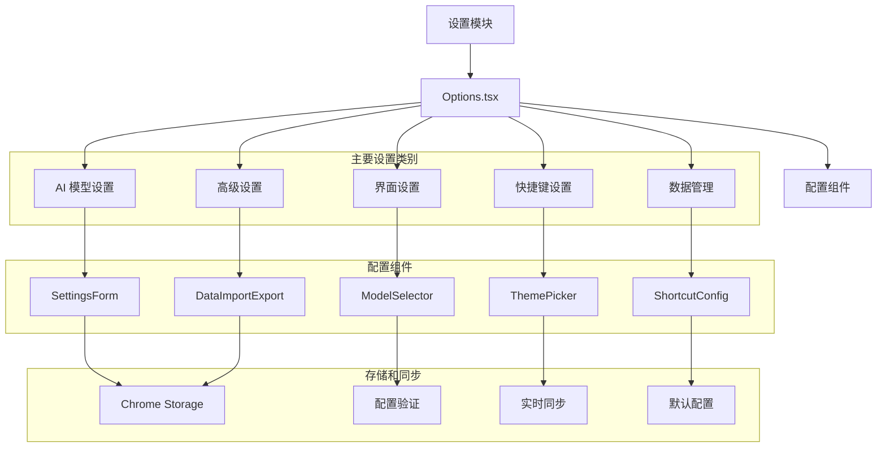

# 设置模块 (Options Module)

> 📍 **模块路径**: `entrypoints/options/`
> 🔗 **导航**: [项目根](../../CLAUDE.md) → [设置模块](./CLAUDE.md)
> 📋 **状态**: 完整分析，用户配置管理

## 模块概述

设置模块是人话翻译器的**配置管理中心**，提供完整的用户设置界面，允许用户自定义 AI 模型、翻译参数、界面主题、快捷键等各种配置选项。该模块采用 React 构建设置表单，实现配置的持久化存储和实时同步。

### 核心职责
- ⚙️ **配置管理** - 用户设置的创建、读取、更新、删除
- 🎨 **界面定制** - 主题、字体、语言等界面配置
- 🤖 **模型配置** - AI 模型选择、参数调优
- ⌨️ **快捷键设置** - 自定义快捷键配置
- 📊 **数据管理** - 数据导入导出、清理等管理功能

## 架构图



## 关键文件分析

### 1. 主设置组件

#### `Options.tsx` - 设置页面主组件
```typescript
function Options() {
  const [settings, setSettings] = useState<Settings>(defaultSettings)
  const [loading, setLoading] = useState(false)
  const [activeTab, setActiveTab] = useState('general')

  // 加载设置
  useEffect(() => {
    loadSettings()
  }, [])

  const loadSettings = async () => {
    setLoading(true)
    try {
      const savedSettings = await chrome.storage.sync.get('settings')
      setSettings({ ...defaultSettings, ...savedSettings.settings })
    } catch (error) {
      console.error('Failed to load settings:', error)
    } finally {
      setLoading(false)
    }
  }

  // 保存设置
  const saveSettings = async (newSettings: Partial<Settings>) => {
    try {
      const updatedSettings = { ...settings, ...newSettings }
      await chrome.storage.sync.set({ settings: updatedSettings })
      setSettings(updatedSettings)

      // 通知其他页面设置已更新
      chrome.runtime.sendMessage({
        type: 'SETTINGS_UPDATED',
        payload: updatedSettings
      })
    } catch (error) {
      console.error('Failed to save settings:', error)
    }
  }

  return (
    <div className="options-container">
      <SettingsHeader />
      <SettingsTabs activeTab={activeTab} onChange={setActiveTab} />
      <SettingsContent
        settings={settings}
        onSettingsChange={saveSettings}
        activeTab={activeTab}
      />
    </div>
  )
}
```

**功能特性**:
- ✅ 设置状态管理
- ✅ 配置加载和保存
- ✅ 实时同步通知
- ✅ 错误处理

### 2. 配置子组件

#### AI 模型设置 (`config/AIModelSettings.tsx`)
```typescript
function AIModelSettings({ settings, onChange }: AIModelSettingsProps) {
  const [testConnection, setTestConnection] = useState(false)

  // 模型配置
  const modelOptions = [
    { value: 'gpt-4', label: 'GPT-4', description: '最强大的模型，适合复杂翻译' },
    { value: 'gpt-3.5-turbo', label: 'GPT-3.5 Turbo', description: '快速响应，性价比高' },
    { value: 'claude-3', label: 'Claude 3', description: '优秀的推理能力' }
  ]

  // 测试 API 连接
  const handleTestConnection = async () => {
    setTestConnection(true)
    try {
      const result = await apiService.testConnection(settings.apiConfig)
      showNotification('连接测试成功', 'success')
    } catch (error) {
      showNotification('连接测试失败', 'error')
    } finally {
      setTestConnection(false)
    }
  }

  return (
    <div className="ai-model-settings">
      <ModelSelector
        value={settings.model}
        onChange={(model) => onChange({ model })}
        options={modelOptions}
      />

      <ApiConfigForm
        config={settings.apiConfig}
        onChange={(apiConfig) => onChange({ apiConfig })}
      />

      <ConnectionTest
        onTest={handleTestConnection}
        loading={testConnection}
      />
    </div>
  )
}
```

**功能特性**:
- ✅ 模型选择和配置
- ✅ API 连接测试
- ✅ 参数调优
- ✅ 模型描述和推荐

#### 界面设置 (`config/InterfaceSettings.tsx`)
```typescript
function InterfaceSettings({ settings, onChange }: InterfaceSettingsProps) {
  const [previewTheme, setPreviewTheme] = useState(settings.theme)

  // 主题选项
  const themeOptions = [
    { value: 'light', label: '浅色主题', preview: '☀️' },
    { value: 'dark', label: '深色主题', preview: '🌙' },
    { value: 'auto', label: '跟随系统', preview: '🌗' }
  ]

  // 语言选项
  const languageOptions = [
    { value: 'zh-CN', label: '简体中文' },
    { value: 'zh-TW', label: '繁體中文' },
    { value: 'en', label: 'English' },
    { value: 'ja', label: '日本語' }
  ]

  return (
    <div className="interface-settings">
      <ThemeSettings
        theme={settings.theme}
        onChange={(theme) => onChange({ theme })}
        options={themeOptions}
      />

      <LanguageSettings
        language={settings.language}
        onChange={(language) => onChange({ language })}
        options={languageOptions}
      />

      <AppearanceSettings
        fontSize={settings.fontSize}
        fontFamily={settings.fontFamily}
        onChange={(appearance) => onChange(appearance)}
      />
    </div>
  )
}
```

**功能特性**:
- ✅ 主题切换
- ✅ 多语言支持
- ✅ 字体和字号设置
- ✅ 实时预览

## 依赖关系

### 内部依赖
- **entrypoints/shared/** - 共享常量和类型定义
- **common/logger/** - 日志系统
- **shared/utils/** - 工具函数

### 外部依赖
- **React 19** - UI 框架
- **@icon-park/react** - 图标库
- **Chrome Storage API** - 存储接口

## 配置结构

### 设置接口定义
```typescript
interface Settings {
  // AI 模型配置
  aiModel: {
    provider: 'openai' | 'anthropic' | 'custom'
    model: string
    apiKey: string
    apiEndpoint: string
    maxTokens: number
    temperature: number
    topP: number
    frequencyPenalty: number
    presencePenalty: number
  }

  // 界面配置
  interface: {
    theme: 'light' | 'dark' | 'auto'
    language: string
    fontSize: number
    fontFamily: string
    showThinking: boolean
    autoCopy: boolean
  }

  // 快捷键配置
  shortcuts: {
    translate: string
    toggleThinking: string
    showHistory: string
  }

  // 数据管理配置
  data: {
    autoSave: boolean
    maxHistoryItems: number
    autoExport: boolean
    exportFormat: 'json' | 'csv' | 'txt'
  }

  // 高级配置
  advanced: {
    debugMode: boolean
    analyticsEnabled: boolean
    autoUpdate: boolean
    proxySettings: ProxyConfig
  }
}
```

### 默认配置
```typescript
export const defaultSettings: Settings = {
  aiModel: {
    provider: 'openai',
    model: 'gpt-3.5-turbo',
    apiKey: '',
    apiEndpoint: 'https://api.openai.com/v1/chat/completions',
    maxTokens: 1000,
    temperature: 0.7,
    topP: 1.0,
    frequencyPenalty: 0,
    presencePenalty: 0
  },
  interface: {
    theme: 'light',
    language: 'zh-CN',
    fontSize: 14,
    fontFamily: 'system-ui',
    showThinking: false,
    autoCopy: false
  },
  shortcuts: {
    translate: 'Alt+H',
    toggleThinking: 'Alt+T',
    showHistory: 'Alt+Y'
  },
  data: {
    autoSave: true,
    maxHistoryItems: 1000,
    autoExport: false,
    exportFormat: 'json'
  },
  advanced: {
    debugMode: false,
    analyticsEnabled: true,
    autoUpdate: true,
    proxySettings: {
      enabled: false,
      host: '',
      port: 8080,
      username: '',
      password: ''
    }
  }
}
```

## 验证和约束

### 配置验证
```typescript
// 配置验证器
class SettingsValidator {
  static validate(settings: Partial<Settings>): ValidationResult {
    const errors: string[] = []

    // 验证 API 密钥
    if (settings.aiModel?.apiKey && !this.isValidApiKey(settings.aiModel.apiKey)) {
      errors.push('API 密钥格式不正确')
    }

    // 验证温度参数
    if (settings.aiModel?.temperature !== undefined &&
        (settings.aiModel.temperature < 0 || settings.aiModel.temperature > 2)) {
      errors.push('温度参数必须在 0-2 之间')
    }

    // 验证快捷键
    if (settings.shortcuts) {
      Object.values(settings.shortcuts).forEach(shortcut => {
        if (!this.isValidShortcut(shortcut)) {
          errors.push(`快捷键 ${shortcut} 格式不正确`)
        }
      })
    }

    return { isValid: errors.length === 0, errors }
  }

  private static isValidApiKey(apiKey: string): boolean {
    return /^sk-[a-zA-Z0-9]{48}$/.test(apiKey)
  }

  private static isValidShortcut(shortcut: string): boolean {
    return /^[A-Za-z0-9+]+$/.test(shortcut)
  }
}
```

## 性能优化

### 设置加载优化
- ✅ 异步加载设置
- ✅ 缓存常用配置
- ✅ 批量更新设置
- ✅ 防抖处理频繁更新

### 界面优化
- ✅ 懒加载设置组件
- ✅ 虚拟滚动长列表
- ✅ 表单状态管理优化
- ✅ 减少不必要的重新渲染

## 安全考虑

### 数据安全
- ✅ 敏感信息加密存储
- ✅ API 密钥安全处理
- ✅ 数据传输加密
- ✅ 访问权限控制

### 输入验证
- ✅ 表单数据验证
- ✅ XSS 防护
- ✅ 注入攻击防护
- ✅ 安全的 HTML 处理

## 测试策略

### 单元测试
- ✅ 设置组件渲染测试
- ✅ 表单交互测试
- ✅ 验证逻辑测试
- ✅ 存储操作测试

### 集成测试
- ✅ 设置保存和加载测试
- ✅ 设置同步测试
- ✅ 用户体验测试
- ✅ 错误处理测试

## 维护信息

- **最后更新**: 2025年9月24日 04:24
- **代码行数**: ~600 行
- **组件数量**: 8 个主要组件
- **复杂度**: 中等
- **依赖项**: 4 个外部依赖
- **测试覆盖**: 建议补充

---

*🔗 返回 [项目根目录](../../CLAUDE.md) 或查看其他模块文档*