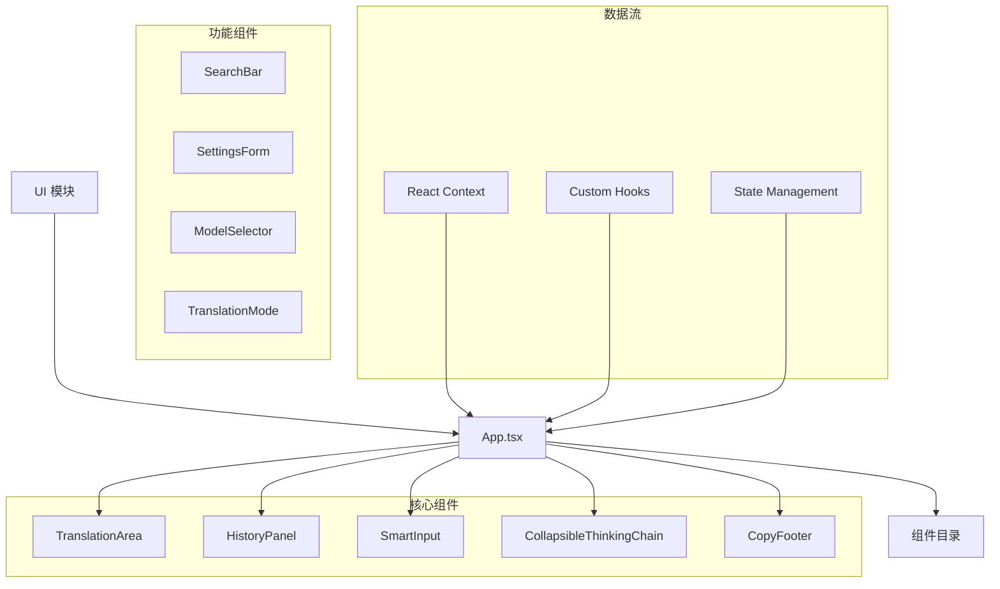

# 用户界面模块 (UI Module)

> 📍 **模块路径**: `entrypoints/popup/`
> 🔗 **导航**: [项目根](../../CLAUDE.md) → [UI 模块](./CLAUDE.md)
> 📋 **状态**: 完整分析，主要用户交互界面

## 模块概述

UI 模块是人话翻译器的**用户界面中心**，提供完整的用户交互体验。该模块采用 React 19 + TypeScript 构建，使用函数式组件和 Hooks 模式，实现了现代化的弹窗界面，包括翻译输入、结果显示、历史管理、设置配置等核心功能。

### 核心职责
- 🎨 **界面渲染** - 基于 React 19 的现代化 UI 组件
- 📝 **翻译交互** - 用户输入、结果展示、流式响应
- 📊 **历史管理** - 历史记录显示、搜索、导出
- ⚙️ **设置界面** - 用户配置的可视化管理
- 🎯 **快捷操作** - 一键复制、智能输入等便捷功能

## 架构图



## 关键文件分析

### 1. 主应用组件

#### `App.tsx` - 应用主组件
```typescript
function App() {
  // 全局状态管理
  const [settings, setSettings] = useState<Settings>(defaultSettings)
  const [translation, setTranslation] = useState<TranslationResult | null>(null)

  // 消息通信
  const messageHandler = useMessageHandler()

  // 历史记录管理
  const historyManager = useHistoryManager()

  return (
    <div className="app-container">
      <Header />
      <MainContent />
      <Footer />
    </div>
  )
}
```

**功能特性**:
- ✅ 全局状态管理
- ✅ 消息通信处理
- ✅ 生命周期管理
- ✅ 错误边界处理

### 2. 核心功能组件

#### `TranslationArea.tsx` - 翻译区域
```typescript
function TranslationArea() {
  const [input, setInput] = useState('')
  const [isTranslating, setIsTranslating] = useState(false)
  const [result, setResult] = useState<TranslationResponse | null>(null)

  // 翻译处理
  const handleTranslate = async (text: string) => {
    setIsTranslating(true)
    const response = await messageHandler.send({
      type: 'TRANSLATE_REQUEST',
      payload: { text, mode: settings.mode }
    })
    setResult(response)
  }

  // 流式响应处理
  const handleStreamResponse = (chunk: string) => {
    setResult(prev => ({
      ...prev,
      result: prev.result + chunk
    }))
  }
}
```

**功能特性**:
- ✅ 实时翻译输入
- ✅ 流式响应显示
- ✅ 输入验证和格式化
- ✅ 历史记录建议

#### `HistoryPanel.tsx` - 历史记录面板
```typescript
function HistoryPanel() {
  const [records, setRecords] = useState<TranslationRecord[]>([])
  const [searchTerm, setSearchTerm] = useState('')

  // 智能搜索
  const filteredRecords = useMemo(() => {
    return fuse.search(searchTerm).map(result => result.item)
  }, [searchTerm, records])

  // 导出功能
  const handleExport = async (format: ExportFormat) => {
    const data = await historyManager.export(format)
    downloadFile(data, `translation-history.${format}`)
  }
}
```

**功能特性**:
- ✅ 智能搜索（Fuse.js）
- ✅ 数据过滤和排序
- ✅ 批量操作
- ✅ 多格式导出

### 3. 交互组件

#### `SmartInput.tsx` - 智能输入组件
```typescript
function SmartInput() {
  const [value, setValue] = useState('')
  const [suggestions, setSuggestions] = useState<string[]>([])

  // 智能建议
  const generateSuggestions = debounce(async (input: string) => {
    if (input.length > 2) {
      const matches = await historyManager.findSimilar(input)
      setSuggestions(matches)
    }
  }, 300)

  // 快捷键支持
  const handleKeyDown = (e: React.KeyboardEvent) => {
    if (e.ctrlKey && e.key === 'Enter') {
      handleTranslate(value)
    }
  }
}
```

**功能特性**:
- ✅ 智能建议和自动补全
- ✅ 快捷键支持
- ✅ 输入历史记录
- ✅ 实时字符统计

#### `CollapsibleThinkingChain.tsx` - 思维链折叠组件
```typescript
function CollapsibleThinkingChain({ thinking }: { thinking: string }) {
  const [isExpanded, setIsExpanded] = useState(false)

  // Markdown 渲染
  const renderThinking = useMemo(() => {
    return parseMarkdown(thinking)
  }, [thinking])

  // 复制功能
  const handleCopy = useCallback(() => {
    copyToClipboard(thinking)
  }, [thinking])
}
```

**功能特性**:
- ✅ 折叠/展开动画
- ✅ Markdown 渲染
- ✅ 复制功能
- ✅ 自定义样式

## 依赖关系

### 内部依赖
- **entrypoints/shared/** - 共享常量和类型定义
- **common/logger/** - 日志系统
- **shared/utils/** - 工具函数

### 外部依赖
- **React 19** - UI 框架
- **@icon-park/react** - 图标库
- **fuse.js** - 模糊搜索
- **dayjs** - 日期处理
- **lodash-es** - 工具函数

## 状态管理

### React Hooks 使用
```typescript
// 自定义 Hooks
const useTranslationState = () => {
  const [state, dispatch] = useReducer(translationReducer, initialState)
  return { state, dispatch }
}

const useHistoryState = () => {
  const [records, setRecords] = useState<TranslationRecord[]>([])
  const [loading, setLoading] = useState(false)
  return { records, setRecords, loading, setLoading }
}
```

### Context API
```typescript
interface AppContext {
  settings: Settings
  updateSettings: (settings: Partial<Settings>) => void
  translation: TranslationState
  history: HistoryState
}

const AppContext = createContext<AppContext | null>(null)
```

## 样式和主题

### Less 样式系统
```less
// 全局样式变量
@primary-color: #1890ff;
@secondary-color: #52c41a;
@danger-color: #f5222d;
@background-color: #f5f5f5;

// 组件样式
.translation-area {
  background: @background-color;
  border-radius: 8px;
  padding: 16px;
  box-shadow: 0 2px 8px rgba(0, 0, 0, 0.1);
}
```

### 响应式设计
- ✅ 弹窗尺寸自适应
- ✅ 移动端优化
- ✅ 深色模式支持
- ✅ 字体大小调整

## 性能优化

### 渲染优化
- ✅ React.memo 避免不必要的重新渲染
- ✅ useMemo 缓存计算结果
- ✅ useCallback 稳定函数引用
- ✅ 虚拟滚动处理大量历史记录

### 数据处理优化
- ✅ 防抖处理用户输入
- ✅ 分页加载历史记录
- ✅ 图片上传压缩
- ✅ 懒加载组件

## 错误处理

### 错误边界
```typescript
class ErrorBoundary extends React.Component {
  componentDidCatch(error: Error, errorInfo: React.ErrorInfo) {
    logger.error('UI Error:', error, errorInfo)
    // 显示用户友好的错误提示
  }

  render() {
    if (this.state.hasError) {
      return <ErrorFallback />
    }
    return this.props.children
  }
}
```

### 用户体验优化
- ✅ 加载状态显示
- ✅ 错误重试机制
- ✅ 空状态处理
- ✅ 离线状态检测

## 测试策略

### 单元测试
- ✅ 组件渲染测试
- ✅ 用户交互测试
- ✅ 状态管理测试
- ✅ 自定义 Hooks 测试

### 集成测试
- ✅ 端到端用户流程测试
- ✅ 消息通信测试
- ✅ 数据流测试

## 维护信息

- **最后更新**: 2025年9月24日 04:24
- **代码行数**: ~1500 行
- **组件数量**: 12 个主要组件
- **复杂度**: 中等
- **依赖项**: 6 个外部依赖
- **测试覆盖**: 建议补充

---

*🔗 返回 [项目根目录](../../CLAUDE.md) 或查看其他模块文档*