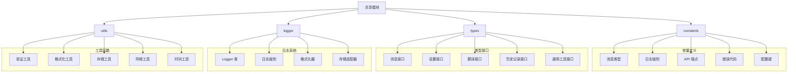

# 共享模块 (Shared Module)

> 📍 **模块路径**: `entrypoints/shared/`
> 🔗 **导航**: [项目根](../../CLAUDE.md) → [共享模块](./CLAUDE.md)
> 📋 **状态**: 完整分析，扩展内部共享核心

## 模块概述

共享模块是人话翻译器的**扩展内部共享核心**，为所有其他模块提供统一的常量定义、类型接口、消息格式、日志系统等基础设施。该模块确保整个扩展的一致性和可维护性，减少代码重复，提供标准化的开发接口。

### 核心职责
- 📝 **常量定义** - 统一的常量和枚举定义
- 🔄 **类型接口** - 共享的 TypeScript 类型定义
- 📨 **消息格式** - 扩展内部通信的消息标准
- 📊 **日志系统** - 统一的日志记录和管理
- 🔧 **工具函数** - 通用的工具函数和辅助方法

## 架构图



## 关键文件分析

### 1. 常量定义

#### `constants/index.ts` - 常量定义
```typescript
// 消息类型枚举
export enum MessageType {
  // 翻译相关
  TRANSLATE_REQUEST = 'TRANSLATE_REQUEST',
  TRANSLATE_RESPONSE = 'TRANSLATE_RESPONSE',
  TRANSLATE_PROGRESS = 'TRANSLATE_PROGRESS',

  // 历史记录相关
  HISTORY_REQUEST = 'HISTORY_REQUEST',
  HISTORY_RESPONSE = 'HISTORY_RESPONSE',
  HISTORY_UPDATE = 'HISTORY_UPDATE',

  // 设置相关
  SETTINGS_GET = 'SETTINGS_GET',
  SETTINGS_UPDATE = 'SETTINGS_UPDATE',
  SETTINGS_RESET = 'SETTINGS_RESET',

  // UI 相关
  POPUP_SHOW = 'POPUP_SHOW',
  POPUP_HIDE = 'POPUP_HIDE',
  POPUP_UPDATE = 'POPUP_UPDATE',

  // 错误处理
  ERROR_OCCURRED = 'ERROR_OCCURRED',
  ERROR_RECOVERED = 'ERROR_RECOVERED'
}

// 日志级别枚举
export enum LogLevel {
  TRACE = 0,
  DEBUG = 1,
  INFO = 2,
  WARN = 3,
  ERROR = 4,
  SILENT = 5
}

// API 端点配置
export const API_ENDPOINTS = {
  OPENAI: 'https://api.openai.com/v1/chat/completions',
  ANTHROPIC: 'https://api.anthropic.com/v1/messages',
  CUSTOM: '' // 用户自定义
}

// 存储键名
export const STORAGE_KEYS = {
  SETTINGS: 'settings',
  HISTORY: 'translation_history',
  CACHE: 'translation_cache',
  STATS: 'usage_statistics'
}

// 错误代码
export enum ErrorCode {
  SUCCESS = 0,
  NETWORK_ERROR = 1001,
  API_ERROR = 1002,
  AUTH_ERROR = 1003,
  RATE_LIMIT = 1004,
  INVALID_INPUT = 1005,
  STORAGE_ERROR = 1006,
  UNKNOWN_ERROR = 9999
}
```

**功能特性**:
- ✅ 统一的枚举定义
- ✅ 标准化的消息类型
- ✅ 配置常量管理
- ✅ 错误代码标准化

### 2. 类型定义

#### `types/index.ts` - 类型接口定义
```typescript
// 基础消息接口
export interface BaseMessage {
  type: MessageType
  payload?: any
  messageId?: string
  timestamp: number
  source: MessageSource
}

// 翻译相关接口
export interface TranslationRequest {
  input: string
  mode: TranslationMode
  options?: TranslationOptions
  context?: TranslationContext
}

export interface TranslationResponse {
  result: string
  thinking?: string
  requestId: string
  timestamp: number
  duration: number
  usage?: TokenUsage
}

export interface TranslationOptions {
  temperature?: number
  maxTokens?: number
  topP?: number
  frequencyPenalty?: number
  presencePenalty?: number
}

// 历史记录接口
export interface HistoryRecord {
  id: string
  input: string
  output: string
  thinking?: string
  mode: TranslationMode
  timestamp: number
  duration: number
  tags?: string[]
}

// 设置接口
export interface Settings {
  aiModel: ModelConfig
  interface: InterfaceConfig
  shortcuts: ShortcutsConfig
  data: DataConfig
  advanced: AdvancedConfig
}

// 工具接口
export interface Validator<T> {
  validate(value: T): ValidationResult
  sanitize(value: T): T
}

export interface Formatter<T> {
  format(value: T): string
  parse(value: string): T
}
```

**功能特性**:
- ✅ 完整的类型体系
- ✅ 接口标准化
- ✅ 类型安全保证
- ✅ 扩展性设计

### 3. 日志系统

#### `logger/index.ts` - 日志系统
```typescript
// 日志器类
export class Logger {
  private namespace: string
  private level: LogLevel
  private storage: LogStorage

  constructor(namespace: string, level: LogLevel = LogLevel.INFO) {
    this.namespace = namespace
    this.level = level
    this.storage = new LogStorage()
  }

  // 日志方法
  trace(message: string, ...args: any[]): void {
    this.log(LogLevel.TRACE, message, ...args)
  }

  debug(message: string, ...args: any[]): void {
    this.log(LogLevel.DEBUG, message, ...args)
  }

  info(message: string, ...args: any[]): void {
    this.log(LogLevel.INFO, message, ...args)
  }

  warn(message: string, ...args: any[]): void {
    this.log(LogLevel.WARN, message, ...args)
  }

  error(message: string, ...args: any[]): void {
    this.log(LogLevel.ERROR, message, ...args)
  }

  success(message: string, ...args: any[]): void {
    this.log(LogLevel.INFO, `✅ ${message}`, ...args)
  }

  private log(level: LogLevel, message: string, ...args: any[]): void {
    if (level >= this.level) {
      const formattedMessage = this.formatMessage(level, message, args)
      this.writeToConsole(level, formattedMessage)
      this.storage.store(level, this.namespace, formattedMessage)
    }
  }

  private formatMessage(level: LogLevel, message: string, args: any[]): string {
    const timestamp = new Date().toISOString()
    const levelName = LogLevel[level]
    const emoji = this.getLevelEmoji(level)

    return `[${timestamp}] ${emoji} [${levelName}] [${this.namespace}] ${message} ${args.length ? JSON.stringify(args) : ''}`
  }

  private getLevelEmoji(level: LogLevel): string {
    switch (level) {
      case LogLevel.TRACE: return '🔍'
      case LogLevel.DEBUG: return '🐛'
      case LogLevel.INFO: return 'ℹ️'
      case LogLevel.WARN: return '⚠️'
      case LogLevel.ERROR: return '❌'
      default: return '📝'
    }
  }
}

// 日志存储
class LogStorage {
  private logs: LogEntry[] = []
  private maxEntries: number = 1000

  async store(level: LogLevel, namespace: string, message: string): Promise<void> {
    const entry: LogEntry = {
      timestamp: Date.now(),
      level,
      namespace,
      message
    }

    this.logs.push(entry)

    // 保持日志数量限制
    if (this.logs.length > this.maxEntries) {
      this.logs = this.logs.slice(-this.maxEntries)
    }

    // 持久化到 Chrome Storage
    await this.persistToStorage()
  }

  async getLogs(filter?: LogFilter): Promise<LogEntry[]> {
    let filteredLogs = this.logs

    if (filter) {
      filteredLogs = this.logs.filter(log => {
        if (filter.level && log.level !== filter.level) return false
        if (filter.namespace && !log.namespace.includes(filter.namespace)) return false
        if (filter.startTime && log.timestamp < filter.startTime) return false
        if (filter.endTime && log.timestamp > filter.endTime) return false
        return true
      })
    }

    return filteredLogs
  }
}
```

**功能特性**:
- ✅ 分级日志记录
- ✅ 格式化输出
- ✅ 存储管理
- ✅ 过滤和查询

### 4. 工具函数

#### `utils/index.ts` - 工具函数集合
```typescript
// 验证工具
export const ValidationUtils = {
  // 邮箱验证
  isValidEmail(email: string): boolean {
    return /^[^\s@]+@[^\s@]+\.[^\s@]+$/.test(email)
  },

  // API 密钥验证
  isValidApiKey(apiKey: string): boolean {
    return /^sk-[a-zA-Z0-9]{48}$/.test(apiKey)
  },

  // URL 验证
  isValidUrl(url: string): boolean {
    try {
      new URL(url)
      return true
    } catch {
      return false
    }
  },

  // 文本长度验证
  isValidTextLength(text: string, min: number, max: number): boolean {
    return text.length >= min && text.length <= max
  }
}

// 格式化工具
export const FormatUtils = {
  // 日期格式化
  formatDate(timestamp: number, format: string = 'YYYY-MM-DD HH:mm:ss'): string {
    return dayjs(timestamp).format(format)
  },

  // 文件大小格式化
  formatFileSize(bytes: number): string {
    const sizes = ['B', 'KB', 'MB', 'GB']
    if (bytes === 0) return '0 B'

    const i = Math.floor(Math.log(bytes) / Math.log(1024))
    return Math.round(bytes / Math.pow(1024, i) * 100) / 100 + ' ' + sizes[i]
  },

  // 数字格式化
  formatNumber(num: number, locale: string = 'zh-CN'): string {
    return new Intl.NumberFormat(locale).format(num)
  }
}

// 存储工具
export const StorageUtils = {
  // Chrome Storage 封装
  async set(key: string, value: any): Promise<void> {
    return new Promise((resolve, reject) => {
      chrome.storage.sync.set({ [key]: value }, () => {
        if (chrome.runtime.lastError) {
          reject(chrome.runtime.lastError)
        } else {
          resolve()
        }
      })
    })
  },

  async get<T>(key: string, defaultValue?: T): Promise<T> {
    return new Promise((resolve, reject) => {
      chrome.storage.sync.get([key], (result) => {
        if (chrome.runtime.lastError) {
          reject(chrome.runtime.lastError)
        } else {
          resolve(result[key] ?? defaultValue)
        }
      })
    })
  },

  async remove(key: string): Promise<void> {
    return new Promise((resolve, reject) => {
      chrome.storage.sync.remove([key], () => {
        if (chrome.runtime.lastError) {
          reject(chrome.runtime.lastError)
        } else {
          resolve()
        }
      })
    })
  }
}

// 网络工具
export const NetworkUtils = {
  // 请求重试
  async fetchWithRetry(
    url: string,
    options: RequestInit = {},
    maxRetries: number = 3
  ): Promise<Response> {
    let lastError: Error

    for (let i = 0; i < maxRetries; i++) {
      try {
        const response = await fetch(url, options)
        if (response.ok) {
          return response
        }
        throw new Error(`HTTP ${response.status}: ${response.statusText}`)
      } catch (error) {
        lastError = error as Error
        if (i < maxRetries - 1) {
          await this.delay(Math.pow(2, i) * 1000) // 指数退避
        }
      }
    }

    throw lastError!
  },

  // 延迟函数
  delay(ms: number): Promise<void> {
    return new Promise(resolve => setTimeout(resolve, ms))
  }
}
```

**功能特性**:
- ✅ 输入验证
- ✅ 数据格式化
- ✅ 存储封装
- ✅ 网络工具

## 依赖关系

### 内部依赖
- **无内部模块依赖** - 作为基础模块，被其他模块依赖

### 外部依赖
- **dayjs** - 日期处理
- **Chrome Extension API** - 存储接口

## 使用示例

### 日志使用
```typescript
import { Logger, LogLevel } from '@/entrypoints/shared/logger'

// 创建日志器
const logger = new Logger('background-service', LogLevel.DEBUG)

// 使用日志
logger.info('服务启动')
logger.debug('处理翻译请求', { input: 'Hello', mode: 'normal' })
logger.error('翻译失败', new Error('Network error'))
logger.success('翻译完成')
```

### 常量使用
```typescript
import { MessageType, ErrorCode } from '@/entrypoints/shared/constants'

// 发送消息
const message = {
  type: MessageType.TRANSLATE_REQUEST,
  payload: { input: 'Hello' },
  timestamp: Date.now()
}

// 处理错误
if (error.code === ErrorCode.NETWORK_ERROR) {
  // 处理网络错误
}
```

### 工具使用
```typescript
import { ValidationUtils, StorageUtils } from '@/entrypoints/shared/utils'

// 验证输入
if (ValidationUtils.isValidEmail('test@example.com')) {
  // 有效邮箱
}

// 存储数据
await StorageUtils.set('userSettings', { theme: 'dark' })
const settings = await StorageUtils.get('userSettings')
```

## 性能优化

### 内存优化
- ✅ 日志条目限制
- ✅ 对象池技术
- ✅ 懒加载
- ✅ 缓存机制

### 存储优化
- ✅ 批量存储操作
- ✅ 数据压缩
- ✅ 增量更新
- ✅ 过期数据清理

## 安全考虑

### 数据安全
- ✅ 敏感信息过滤
- ✅ 存储加密
- ✅ 访问权限控制
- ✅ 输入验证

### 日志安全
- ✅ 敏感信息脱敏
- ✅ 日志访问控制
- ✅ 安全的日志格式
- ✅ 审计追踪

## 测试策略

### 单元测试
- ✅ 常量定义测试
- ✅ 类型定义测试
- ✅ 日志功能测试
- ✅ 工具函数测试

### 集成测试
- ✅ 日志存储测试
- ✅ 消息通信测试
- ✅ 存储操作测试
- ✅ 性能测试

## 维护信息

- **最后更新**: 2025年9月24日 04:24
- **代码行数**: ~1200 行
- **主要文件**: 4 个核心文件
- **复杂度**: 低中等
- **依赖项**: 2 个外部依赖
- **测试覆盖**: 建议补充

---

*🔗 返回 [项目根目录](../../CLAUDE.md) 或查看其他模块文档*